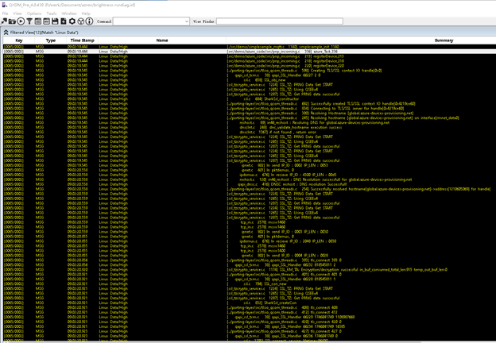
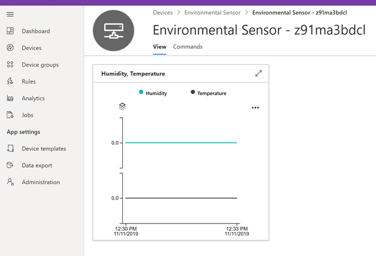

# Integration with IoT Central
After importing the compiled program to the device, restart the device.

You can view the running log through qxdm

 

Go to IoT Central, open the related device. you can get the device data at the view page.

 
