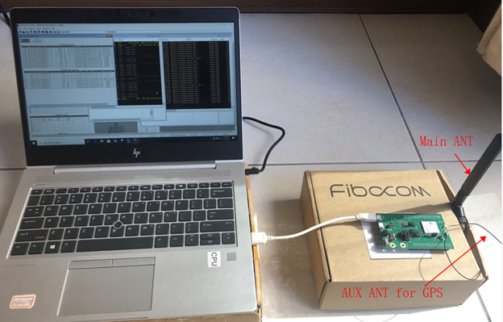
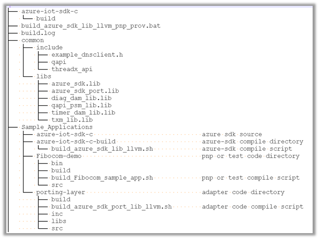
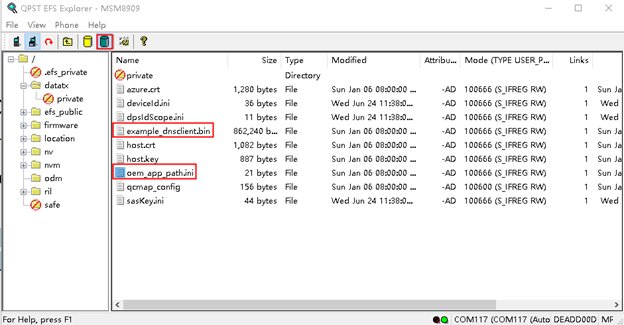
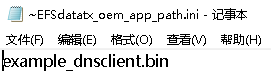

# Prepare the Device

## Hardware Environmental setup

Materials prepared: MA510

Connected device with USB cable

 
 
## Software Environmental Setup 

### Compilation Environment 

OS: Ubuntu 64-bit OS, version 12.04 or 14.04,16.04

Compiler: llvm_4.0.3

### Preparation:

This section describes how to use a device capability model to create an IoT Plug and Play Preview device.

Firstly, you should install Azure IoT tools on Windows 10

Use the following steps to install the [Azure IoT Tools for VS Code](https://marketplace.visualstudio.com/items?itemName=vsciot-vscode.azure-iot-tools) extension pack:

-   In VS Code, select the **Extensions** tab.
-   Search for **Azure IoT Tools**.
-   Select **Install**.

Then, Author your model on VS Code:

Create a pnp_app directory in your local drive. Download the [Device Capability Model](https://github.com/Azure/IoTPlugandPlay/blob/master/samples/EnvironmentalSensorInline.capabilitymodel.json) and [Interface Sample](https://github.com/Azure/IoTPlugandPlay/blob/master/samples/EnvironmentalSensor.interface.json) files to the pnp_app folder.

Note: the DCM file is the same with DCM file that used to create device template.

Open pnp_app folder with VS Code. In the files you downloaded, replace <YOUR_COMPANY_NAME_HERE> in the @id and schema fields with your own name.
Note: Only characters a-z, A-Z, 0-9, and underscore permitted).

### Generate the C code stub

With the folder with DCM files open, use **Ctrl+Shift+P** to open the command palette, enter **IoT Plug and Play**, and select **Generate Device Code Stub**.

Enter the project name **sample_device**, it will be the name of your device application.
Choose **Via DPS (Device Provisioning Service) symmetric key** as connection method.
Choose **ANSI C** as your language.
Choose **CMake Project on Linux** as your project template.
Choose **Via Source Code** as the way to include the SDK.

VS Code opens a new window with generated device code stub files.

## Get Azure IoT device SDK for C on Ubuntu

Open a command prompt. Execute the following command to clone the Azure IoT C SDK GitHub repository:

	git clone https://github.com/Azure/azure-iot-sdk-c --recursive -b public-preview

You should expect this operation to take several minutes to complete.

## Build the code

Create the following directory structure

 

Copy the azure sdk code to Sample_Applications/azure-iot-sdk-c
9205 does not support CMAKE, so we can’t use Azure IoT SDK’s CMAKE script to compile this part, alternately we pick-up files manually and compile with llvm.

Followed file should be picked-up:

All the files for azure_sdk.lib:
-   All the files in "%AZURE_SDK_SRC_PATH%\c-utility
-   All the files in "%AZURE_SDK_SRC_PATH%\serializer\src
-   All the files in "%AZURE_SDK_SRC_PATH%\iothub_client\src
-   "%AZURE_SDK_SRC_PATH%\deps\parson\parson.c"
-   MQTT files:
-   "%AZURE_SDK_SRC_PATH%\umqtt\src\mqtt_client.c" ^
-   "%AZURE_SDK_SRC_PATH%\umqtt\src\mqtt_codec.c" ^
-   "%AZURE_SDK_SRC_PATH%\umqtt\src\mqtt_message.c
-   All the files in "%AZURE_SDK_SRC_PATH%\digitaltwin_client\src
-   DPS files:
-   "%AZURE_SDK_SRC_PATH%\certs\certs.c"
-   "%AZURE_SDK_SRC_PATH%\provisioning_client\
-   "%AZURE_SDK_SRC_PATH%\provisioning_client\deps\utpm\deps\c-utility\src\http_proxy_stub.c

Run “build_azure_sdk_lib_llvm.bat”, then new azure_sdk_port.lib will be built.

Run build_Fibocom_sample_app.sh,then pnp demo will be built

## Debugging Environment
OS: Windows 7 /8/10

Use EFS Explorer in QPST to copy the created executable (.bin) to /datax in the file system.

The path of that location (/datax) must be configured in oem_app_path.ini (pseudo name), which is located in /datax
 
 

-   

